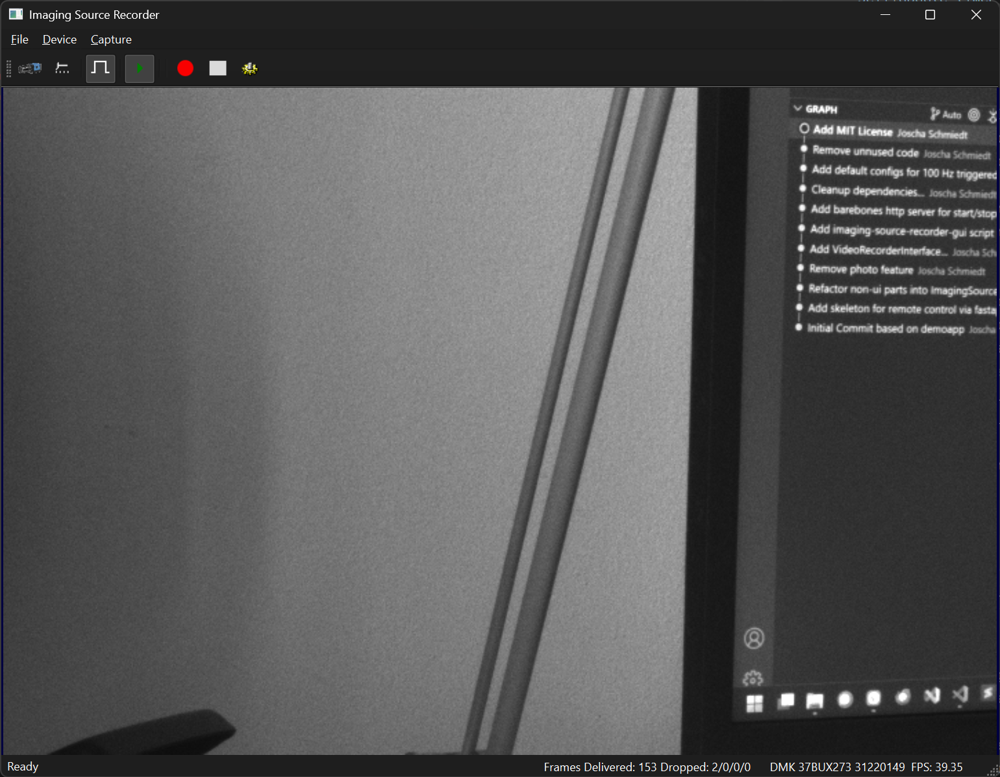

# Imaging Source Recorder

A Qt-desktop app for recording from an Imaging Source Camera. Based on the [PySide6 demoapp](https://github.com/TheImagingSource/ic4-examples), licensed with the APACHE license.



## Design goals

- [x] Provide desktop app to manually start/stop triggered recordings from Imaging Source Cameras
- [x] Allow starting/stopping of recordings with a given filename via REST API
- [x] Add metadata to recordings
- [x] Add retreiving ~~last~~ recorded files via HTTP
- [ ] Specify metadata schema

## Execute the GUI with uv

```
uvx --from git+https://github.com/brain-bremen/imaging-source-recorder imaging-source-recorder-gui
```

## Test REST API

While the GUI is running, go to http://localhost:8000/docs to explore the API.


## Distribute via pyinstaller (for Windows only)

```
# create new spec file
pyinstaller .\src\gui.py  --collect-binaries imagingcontrol4 --add-data ".\images;images" --name "imaging-source-recorder" --contents-directory "." --window --icon .\images\tis.ico
# or use existing
pyinstaller imaging-source-recorder.spec
```
